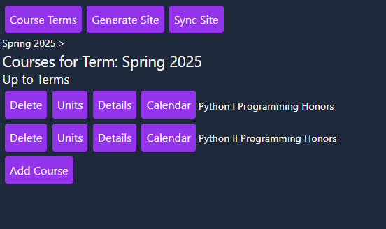
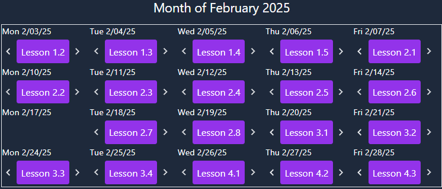
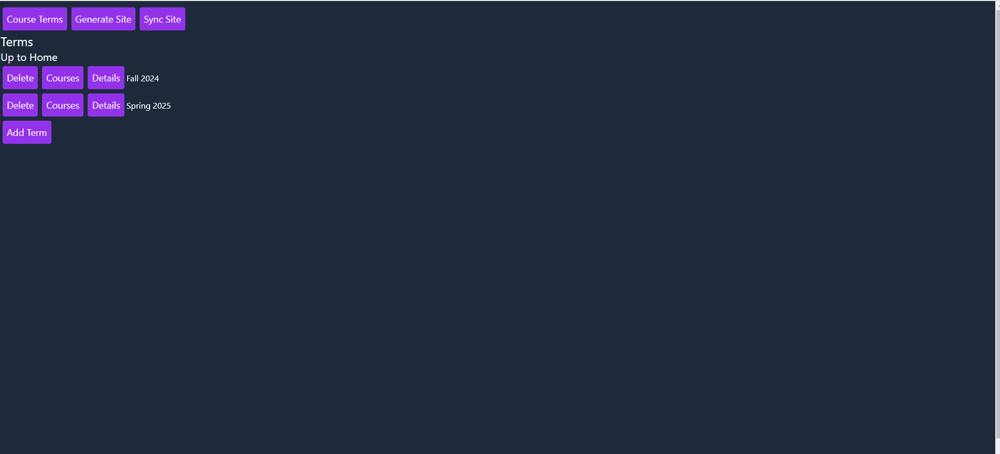

# 📜 License
This project is licensed under the Apache License 2.0.

You are free to use, modify, and distribute this software, but attribution is required.
See the [LICENSE](LICENSE) file for full details.

## Project Overview

This project is still very early in development, and the UI is quite rough still.  But already quite useful in my daily tasks as a teacher. For example I can go to my calendar (see screenshot) and move lessons right or left with a click and then generate and sync the site with another two clicks, and students will see the change reflected in the student-facing site. It's a course manager and site generator for teachers. An essential feature is the ability to quickly create lightweight slides from markdown through the app using Marp. This allows me to easily take text generated by AI models, turn it into lesson slides and share with students for the day's lesson with a few clicks. An example of the site generated by the app is hosted on Github Pages and can be seen here:

<https://whlapinel.github.io/python/courses/courses.html>

The application began as a personal Fyne desktop application, just for my own personal use, but in December my vision for the project grew and I scrapped the Fyne app and switched it over to a web application in anticipation of potentially making it available to fellow teachers.

## Technologies

It features a Go server on the backend, generating HTML with Templ, and HTMX on the frontend and Tailwind for styles. I thought I'd be writing more Typescript but I haven't needed to yet thanks to the marvelous HTMX, which, as always, greatly simplifies the overall problem by eliminating the problem of having two states to manage. Marp is used for slide generation from markdown.  I use SQLC for generating Go code from SQL queries and Goose for database migrations.

